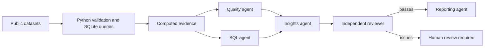

# Atlas Analytics Team
## A multi-agent portfolio project across three industries

Python and SQL analyze retail transactions, transportation demand and household energy.
Five optional AI workers review the computed evidence through explicit handoffs. The included completed reports come from deterministic calculations. Live API execution is opt-in and is not required to view the results.

Start with [the report](artifacts/REPORT.md) and [the dashboard](artifacts/dashboard.png).

## Upload-and-ask desktop window

On Windows, double-click **Setup Atlas.cmd** once to install dependencies, then **Open Atlas.cmd**.
Choose a CSV, Excel workbook, text-based PDF, TXT, Markdown or JSON report. Enter your question.
**Preview locally (free)** profiles the file without contacting an API. **Try sample report** loads the included report.
For an AI response, enter your API key, select an available model, then click **Ask AI Team (paid)**. The default `gpt-5-mini` keeps a five-call test relatively economical. Model IDs are normalized to lowercase, so a display name such as `GPT-5.5` becomes `gpt-5.5`.
The key stays in process memory and is not saved. **Save response** exports the visible answer as Markdown or text.

Tables are profiled up to 100,000 rows and 100 columns; only the first Excel sheet is included. No raw rows are sent to AI, but column names and numeric statistics are sent. Documents send up to 40,000 extracted characters. PDF extraction covers at most 30 pages and does not analyze charts, images or scanned text. Scope limits appear in the preview and final response. User uploads get generic profiling or document review, not the fixed three-industry SQL pipeline.
Agent responses are saved under artifacts/submissions. That folder is excluded from Git. The window remains responsive during requests. A failed review displays the review issues instead of releasing a final report.

The portable ZIP includes source code and generated reports. Raw datasets and the SQLite database are omitted to keep it small; the download command recreates them. The local project folder contains both.

## Run locally

Python 3.11 or later:

```powershell
python -m venv .venv
.venv\Scripts\python -m pip install -r requirements.txt
.venv\Scripts\python pipeline.py --download
.venv\Scripts\python -m unittest discover -s tests -v
```

After the first download, use `python pipeline.py` to run from cached source files.
Paths are relative to the script, so running from another working directory also works.
Artifacts are regenerated on each run. Downloaded archives are cached; remove a cache file deliberately to fetch a changed source.

## The AI team



Each worker has a separate role prompt and API call. Quality and SQL reviews run concurrently.
The insight worker receives both reviews; the independent reviewer checks the draft against the same evidence.
A failed review stops reporting. The reporting worker receives the review and evidence.
This is a bounded multi-agent review workflow, not an autonomous data scientist: it does not execute model-generated code, SQL or cleanup decisions.

## Run live agents

Set `OPENAI_API_KEY` securely in your local environment, and set `OPENAI_MODEL` to a model available to your API project. Do not paste keys into chat or commit them.

```powershell
.venv\Scripts\python pipeline.py --agents --model YOUR_AVAILABLE_MODEL
```

This makes paid API requests. Only aggregate evidence, SQL and quality statistics are sent, not raw customer rows.
Normally five calls run, each with at most three attempts for selected transient HTTP failures.
Responses and token usage are saved in a unique run folder under artifacts/agents. COMPLETE.json marks a successful run. RUNNING.json left behind means the run did not complete. Previous runs are never reused as current results. Inspect all AI claims before sharing.
`store=False` is requested; this is not a statement about all provider retention policies.
Mocked orchestration tests do not prove live model availability or output quality.

## Included validation

The full dataset run processed 579,023 records and passed seven reconciliation gates. Sixteen unit tests passed. See BUILD_REVIEW.md for actual build-time agent contributions and the live-API testing limitation.

If Python reports a certificate error while downloading on Windows, run download-windows.ps1, then retry pipeline.py --download. The helper uses Windows certificate validation and does not disable HTTPS verification.

## Business questions

- Retail: Where is transaction value concentrated, and what share of identified customers placed multiple orders?
- Transportation: When are observed rentals highest, and how does a time-of-week baseline perform on later observations?
- Energy: How does appliance consumption vary through the day, and how accurately does a time-of-day baseline describe later intervals?

## Metric and cleaning decisions

Retail retains duplicate lines and flags them for review. Sales have positive quantity/price and no cancellation prefix.
Credits have a cancellation prefix, negative quantity and positive price. All other rows are excluded from the scoped value metrics and counted separately.
Net recorded value is gross value less credit value. Identified-customer repeat share is customers with more than one distinct sale invoice divided by all identified sale customers.
Missing customers do not remove otherwise eligible sales. There is no claim of profit, margin, or matched return rate.

Bike metrics use hour.csv only; day.csv is an independent reconciliation source.
Missing hours are counted, never imputed to zero. Casual and registered counts reconcile to total rentals and are not predictors.
The baseline trains on the first 80% of timestamps and evaluates on the last 20%, with training-only hour-of-week means and a global-mean fallback.

Appliance readings are Wh per 10-minute interval. Daily kWh is sum(Wh)/1000, without multiplying by interval duration.
Only 144-observation days enter the complete-day average after unique timestamps and cadence checks.
The baseline uses training-only hour/minute means. No contemporaneous sensor predictors, random variables, tuned models or causal savings claims are used.

## Files

- pipeline.py: downloads, preparation, SQL execution, checks, baselines and reports.
- agents.py and prompts/: bounded LLM team and handoff logic.
- sql/: six readable aggregation queries.
- tests/: edge cases, temporal leakage and agent review gates.
- artifacts/evidence.json: metrics, tables, SQL, source hashes and assumptions.
- artifacts/analytics.sqlite: prepared tables for independent SQL exploration.
- artifacts/*.csv: aggregated tables for Excel, Power BI or Tableau.
- SOURCES.md: attribution and licensing.

## Portfolio presentation

Explain one cleaning decision per industry, demonstrate a SQL query, and show a failed validation test.
Describe how the agents consume evidence, why their prose needs review, and how the deterministic mode differs from live AI execution.
Then identify an extension: a retail cohort study, a station-level transportation dataset, or an energy intervention experiment.

Use resume claims only after you have run and understood the project. A defensible draft:

“Developed a Python and SQL analytics pipeline spanning three industries, with reproducible data-quality checks, visual reports, and an integrated five-agent AI review workflow.”

Do not claim the API was tested live unless you have actually completed a live run.
Do not claim business savings or accuracy improvements without an appropriate measured comparison.
