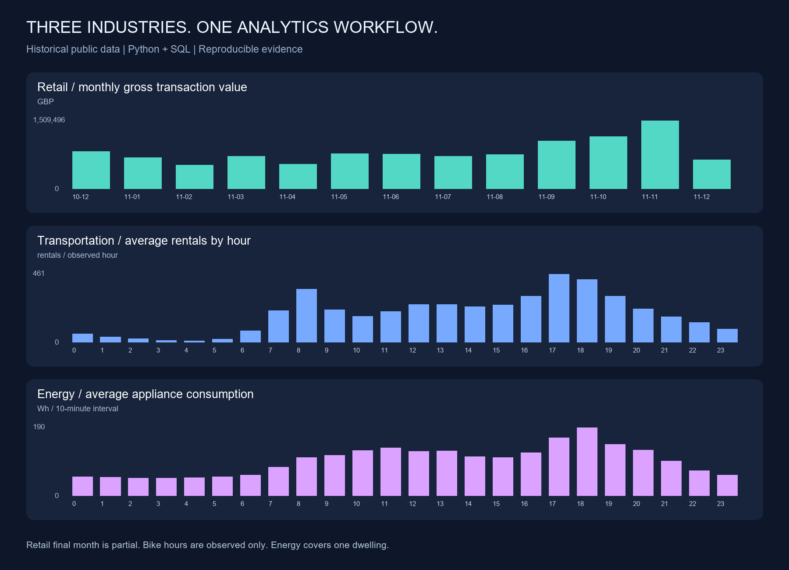

# Three-industry analysis report

Executed mode: deterministic Python/SQL. Live LLM reviews are a separate opt-in run.

## Retail

- **Source rows**: 541,909
- **Gross (GBP)**: 10,666,684.54
- **Credits (GBP)**: 896,812.49
- **Net (GBP)**: 9,769,872.05
- **Orders**: 19,960
- **Gross order value (GBP)**: 534.40
- **Identified customers**: 4,338
- **Repeat customer share**: 65.6%

Recorded transaction value in GBP, not profit or accounting revenue. Exact duplicates retained because repeated lines may be legitimate. Positive-price sales and cancellation credits only; other adjustments excluded. Missing customers retained for sales, excluded from repeat-customer metrics. December 2011 is partial.

## Bike

- **Source rows**: 17,379
- **Rentals**: 3,292,679
- **Mean rentals observed hour**: 189.46

Observed rentals in one system, not unique riders or unmet demand. Missing hours remain missing. Profiles average observed hours only. No causal or station-level conclusions.

## Energy

- **Source rows**: 19,735
- **Appliance (kWh)**: 1,928.01
- **Complete days**: 136
- **Partial days**: 2
- **Mean complete day (kWh)**: 14.03

One dwelling over part of a year. Appliances is Wh per 10-minute interval; sum/1000 yields kWh. Lighting is separate. Partial days excluded from complete-day averages. No demonstrated savings or annual generalization.

## Findings and proposed actions

- Retail: United Kingdom has the largest gross transaction value (9,025,222.08 GBP). Investigate market concentration before recommending expansion.
- Bike: the highest hour/working-day group averages 525.3 rentals at hour 17, workingday=1. Investigate staffing needs; station-level allocation needs station data.
- Energy: hour 18 has the largest mean appliance reading (190.4 Wh per interval). Investigate appliance schedules; savings require an intervention study.

## Quality and baseline evaluation

All reconciliation gates passed. Exact duplicates are reported and retained. Detailed missingness, excluded rows, source hashes, and chronological baseline MAE are in evidence.json.
The seasonal baseline uses training-only group means and is compared with a training-only constant mean. No tuned predictive model is claimed.

| Dataset | Time-group baseline MAE | Constant-mean baseline MAE | Units |
|---|---:|---:|---|
| Bike | 101.38 | 174.98 | Rentals per observed hour |
| Energy | 46.95 | 52.68 | Wh per 10-minute interval |

Data-quality findings: 5,268 exact retail duplicates retained; 2,517 retail rows excluded from scoped value metrics; 165 absent bike hours; 2 partial energy days.

## Sources

See ../SOURCES.md for authors, original datasets, licenses and scope.